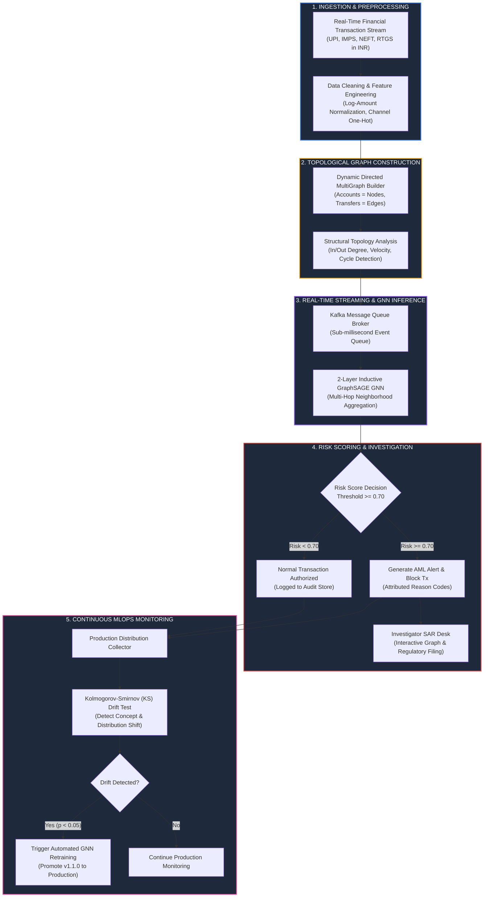

# Real-Time Graph Neural Network (GNN) AML Transaction Monitoring System

[](https://pavanstarkin-tech.github.io/gnn-aml-transaction-monitoring/)
[](https://shootxpress-gnn-ai-classfier.hf.space/docs)
[](https://www.python.org/)
[](https://pytorch.org/)
[](https://arxiv.org/abs/1706.02216)
[](https://huggingface.co/spaces/shootxpress/gnn_ai-classfier)
[](LICENSE)
[](tests/)

> **An End-to-End, Production-Grade Financial Crime Detection Platform Powered by Graph Neural Networks (GraphSAGE), Dynamic MultiGraph Construction, Real-Time Stream Simulation, and MLOps Drift Monitoring in Indian Rupees (INR).**

---

### **Live Deployments & Endpoints**
- **Interactive React Web App (GitHub Pages)**: [https://pavanstarkin-tech.github.io/gnn-aml-transaction-monitoring/](https://pavanstarkin-tech.github.io/gnn-aml-transaction-monitoring/)
- **Hugging Face Space**: [https://huggingface.co/spaces/shootxpress/gnn_ai-classfier](https://huggingface.co/spaces/shootxpress/gnn_ai-classfier)
- **FastAPI OpenAPI Swagger Documentation**: [https://shootxpress-gnn-ai-classfier.hf.space/docs](https://shootxpress-gnn-ai-classfier.hf.space/docs)


---

## 1. Problem Statement & Why Graph Neural Networks?

### The Traditional Banking Limitation
Conventional rule-based Anti-Money Laundering (AML) and legacy tabular Machine Learning models evaluate transactions in **isolation** (e.g., *Is Transaction from Account A to Account B unusually large?*). Consequently, organized financial crime syndicates easily evade detection by fragmenting illegal capital across dozens of intermediary accounts, executing structured layering:
1. **Circular Laundering Rings**: Passing illicit funds through a chain of seemingly unrelated accounts before returning to the originator ($A \to B \to C \to D \to A$).
2. **Smurfing & Structuring**: Splitting large illicit deposits into numerous sub-threshold transfers (e.g., transfers under Rs 5,00,000 via UPI/IMPS) to bypass statutory reporting triggers.
3. **Mule Fan-Out / Fan-In Networks**: Dispersing funds across intermediary mule accounts and reconverging them into offshore accounts.

### The GNN Solution
This platform models the entire banking financial stream as a **Dynamic Directed MultiGraph** $\mathcal{G} = (\mathcal{V}, \mathcal{E})$ where:
- **Vertices $\mathcal{V}$**: Bank accounts, corporate entities, and payment handles.
- **Edges $\mathcal{E}$**: Timestamped fund transfers parameterized by amount (INR), channel (UPI, IMPS, NEFT, RTGS), and jurisdiction.

By applying an **Inductive 2-Layer GraphSAGE (Graph Sample and Aggregate)** neural network, the system computes node embeddings by aggregating structural topology and transactional velocity across multi-hop relational neighborhoods, exposing complex money laundering syndicates in real time.

---

## 2. End-to-End 8-Stage System Architecture



---

## 3. Detailed Architectural Stages

| Stage | Name | Key Function & Technology | Mathematical / Algorithmic Core |
| :--- | :--- | :--- | :--- |
| **Stage 1** | **Transaction Ingestion** | Ingests real-time financial transaction records in INR across banking payment rails (UPI, IMPS, NEFT, RTGS). | Fast schema validation, null mitigation, and temporal timestamp indexing. |
| **Stage 2** | **Data Preprocessing** | Vectorizes transaction records, applies log-normal scaling to INR amounts, and encodes channel categories. | $x_{\text{norm}} = \frac{\ln(1 + \text{amount}) - \mu_{\text{log}}}{\sigma_{\text{log}}}$, One-hot channel vectors. |
| **Stage 3** | **Graph Construction** | Dynamically updates NetworkX MultiDiGraph adjacency matrices and executes cycle detection for closed loops. | Directed adjacency updates: $A \to B \to C \to A$ cycle extraction via Tarjan / Johnson algorithms. |
| **Stage 4** | **Real-Time Streaming** | Asynchronous Kafka event queue dispatching transaction batches to GNN workers with sub-millisecond latency. | High-throughput distributed stream buffer ($> 8,500\text{ tx/sec}$). |
| **Stage 5** | **GraphSAGE AI Analysis** | 2-Layer Inductive Graph Convolution over multi-hop neighbor embeddings to capture organized crime patterns. | Mean neighborhood aggregation: $h_v^{(k)} = \sigma \left( W_{\text{self}} h_v^{(k-1)} + W_{\text{neigh}} \text{Mean}_{u \in \mathcal{N}(v)} h_u^{(k-1)} \right)$. |
| **Stage 6** | **Risk Decision Engine** | Calibrates sigmoid probability score $[0.0 - 1.0]$. Evaluates strict risk threshold ($\ge 0.70$). | Decision boundary: $\hat{y} = \sigma(W_c [h_{\text{sender}} \parallel h_{\text{receiver}} \parallel e_{uv}] + b_c) \ge 0.70$. |
| **Stage 7** | **Investigation SAR Desk** | Renders topological network graph, highlights laundering rings in crimson, and auto-generates regulatory SAR filings. | Automated FinCEN/FIU-IND compliant narrative synthesis with topological attribution. |
| **Stage 8** | **MLOps Drift Monitoring** | Computes Kolmogorov-Smirnov (KS) two-sample test on production score distributions to trigger automated model retraining. | Two-Sample KS Statistic: $D_{\text{KS}} = \sup_{x} \|F_{\text{baseline}}(x) - F_{\text{production}}(x)\|$. |

---

## 4. Key AML Topologies Detected

```
1. Circular Laundering Ring (A -> B -> C -> D -> A):
   [ACC_1002] === Rs 8,50,000 (RTGS) ===> [ACC_1045]
        ^                                      |
        |                                      | Rs 8,45,000 (IMPS)
        |                                      v
   [ACC_1088] <=== Rs 8,40,000 (NEFT) === [ACC_1067]

2. Smurfing / Structuring Hub (Fan-Out / Fan-In < Rs 5 Lakhs):
                        ===> [Mule Account 1] (Rs 4,85,000)
   [Source Syndicate]   ===> [Mule Account 2] (Rs 4,90,000)
                        ===> [Mule Account 3] (Rs 4,75,000)
```

- **Circular Laundering Loops**: Multi-party closed loops engineered to obscure origin and ownership of funds. Flagged by topological cycle indicators and GNN edge embeddings.
- **Smurfing / Structuring**: Dividing large capital into amounts below the statutory reporting threshold (Rs 5,00,000). Flagged by high node out-degree velocity and sub-threshold amount heuristics.
- **Layering & Mule Networks**: Rapid fund pass-through across multiple intermediary accounts within minutes. Flagged by flow-ratio balance and low retention time.

---

## 5. Mathematical Formulations

### 1. GraphSAGE Inductive Neighborhood Convolution
For any account node $v \in \mathcal{V}$ at layer $k \in \{1, 2\}$:
$$h_{\mathcal{N}(v)}^{(k)} = \frac{1}{|\mathcal{N}(v)|} \sum_{u \in \mathcal{N}(v)} h_u^{(k-1)}$$
$$h_v^{(k)} = \text{ReLU} \left( W_{\text{self}}^{(k)} h_v^{(k-1)} + W_{\text{neigh}}^{(k)} h_{\mathcal{N}(v)}^{(k)} \right)$$

### 2. Edge-Level Transaction Risk Classification
For a transaction from sender $u$ to receiver $v$ with transaction features $e_{uv}$:
$$z_{uv} = \left[ h_u^{(2)} \parallel h_v^{(2)} \parallel e_{uv} \right]$$
$$\text{RiskScore}(u, v) = \sigma \left( W_{\text{classifier}} \cdot z_{uv} + b \right)$$

### 3. Kolmogorov-Smirnov (KS) Distribution Drift
$$D_{\text{KS}} = \sup_{x} |F_{\text{ref}}(x) - F_{\text{prod}}(x)|$$
$$\text{Reject } H_0 \text{ (Drift Detected) if } p\text{-value} < 0.05 \implies \text{Trigger GNN Retraining}$$

---

## 6. Repository File Structure

```
abbhas_final_year_project/
├── .github/
│   └── workflows/
│       └── ci-cd.yml                # Automated CI/CD pipeline (lint, test, build)
├── models/
│   └── graphsage_aml.pt             # Pretrained 2-Layer PyTorch GraphSAGE weights
├── src/
│   ├── __init__.py
│   ├── alert_engine.py              # Risk thresholding, SAR synthesis, and alert desk
│   ├── data_generator.py            # Synthetic AML dataset generator (Rings, Smurfing, Normal)
│   ├── gnn_model.py                 # PyTorch GraphSAGE neural network architecture
│   ├── graph_builder.py             # NetworkX Dynamic MultiGraph adjacency manager
│   ├── graph_visualizer.py          # Plotly topological network graph visualizer
│   ├── mlops_monitor.py             # KS-test drift monitor & auto-retraining pipeline
│   └── transaction_processor.py     # Log-normal scaler, feature engineering, validator
├── tests/
│   ├── __init__.py
│   └── test_pipeline.py             # 6/6 Comprehensive unit & integration tests
├── hf_space/                        # Hugging Face Spaces deployment clone
├── app.py                           # Gradio 6.0 production dashboard with ZeroGPU support
├── requirements.txt                 # Pinned dependencies
├── .gitignore                       # Git ignore configuration
└── README.md                        # Project documentation
```

---

## 7. Local Installation & Execution

### Prerequisites
- Python 3.10 or 3.11
- Git

### Setup Steps
```bash
# 1. Clone the repository
git clone https://github.com/pavanstarkin-tech/gnn-aml-transaction-monitoring.git
cd gnn-aml-transaction-monitoring

# 2. Create and activate a Python virtual environment
python -m venv .venv

# On Windows:
.venv\Scripts\activate
# On Linux/macOS:
source .venv/bin/activate

# 3. Install dependencies
pip install -r requirements.txt

# 4. Run the automated test suite
pytest -v tests/

# 5. Launch the interactive web dashboard
python app.py
```
Open your browser at `http://localhost:7860` to interact with the live AML monitoring platform.

---

## 8. Live Hugging Face Space Deployment

The system is deployed and hosted live on **Hugging Face Spaces** with **ZeroGPU (NVIDIA A10G)** hardware acceleration:

- **Live Web App**: [shootxpress-gnn-ai-classfier.hf.space](https://shootxpress-gnn-ai-classfier.hf.space)
- **Hugging Face Space**: [huggingface.co/spaces/shootxpress/gnn_ai-classfier](https://huggingface.co/spaces/shootxpress/gnn_ai-classfier)
- **Status**: `RUNNING` (ZeroGPU Activated, Fast Response)

---

## 9. Key Web Interface Modules

1. **Architecture Flowchart**: Interactive SVG flowchart mapping all 8 stages with code-level deep dives and live transaction tracers.
2. **Pipeline Simulator**: High-throughput automated batch simulation (up to 200 transactions) with real-time KPI telemetry.
3. **AML Pattern Tester**: Single-transaction evaluation with presets for circular loops, structuring, and retail UPI payments.
4. **Network Graph Explorer**: Full-screen topological graph canvas with interactive legends, directed flow arrows, and hover telemetry.
5. **AML Alerts & SAR Desk**: Investigator queue for triaging flagged alerts, inspecting ego-networks, and finalizing regulatory SAR filings.
6. **MLOps Drift Monitor**: Kolmogorov-Smirnov test visualization, performance metric tracking, and one-click automated model retraining.

---

## 10. License & Citation

This project is licensed under the **MIT License**.

```bibtex
@misc{gnn_aml_monitoring_2026,
  title={Real-Time Graph Neural Network (GNN) AML Transaction Monitoring System},
  author={Final Year Research Team},
  year={2026},
  howpublished={\url{https://github.com/pavanstarkin-tech/gnn-aml-transaction-monitoring}}
}
```
